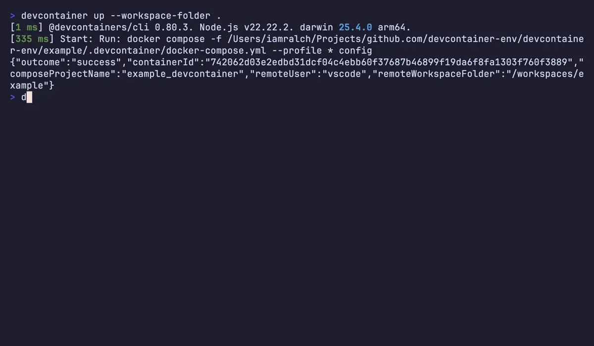

# devcontainer-env

> Bridge devcontainers and the host environment — run host commands with devcontainer service environments and automatically rewrite container service URLs to host ports.

[](https://github.com/devcontainer-env/devcontainer-env/actions/workflows/test.yml)
[](https://github.com/devcontainer-env/devcontainer-env/releases/latest)
[](https://crates.io/crates/devcontainer-env)
[](LICENSE)



## Installation

### Cargo (Crates.io)

```bash
cargo install devcontainer-env
```

### Nix (recommended)

Run directly without installing:

```bash
nix run github:devcontainer-env/devcontainer-env -- exec -- your-command
```

Or install into your profile:

```bash
nix profile install github:devcontainer-env/devcontainer-env
```

## Usage

```
Usage: devcontainer-env <COMMAND>

Commands:
  inspect  Inspect and display the devcontainer environment configuration and service port mappings.
  export   Export devcontainer service environment variables with container URLs rewritten to host ports.
  exec     Execute a host command with the devcontainer service environment applied, rewriting container URLs to host ports.
  help     Print this message or the help of the given subcommand(s)

Options:
  -h, --help     Print help
  -V, --version  Print version
```

**devcontainer-env export** — Output environment variables from `containerEnv` as shell statements.

Only variables defined in the `containerEnv` section are exported to the host (not service configuration or service environment variables). See [Configuration](#configuration) for an example.

```bash
$ devcontainer-env export
```

```bash
export EXAMPLE_API_DATABASE_URL=postgres://vscode@127.0.0.1:32771/example-db?sslmode=disable
```

**devcontainer-env exec** — Run a command with devcontainer environment available:

```bash
devcontainer-env exec -- <COMMAND> [ARGS...]
```

The `--` separator is required. Everything after `--` is passed to the command.

**devcontainer-env inspect** — Parse and display the devcontainer configuration:

```bash
$ devcontainer-env inspect
```

```bash
Workspace: /Users/iamralch/Projects/github.com/devcontainer-env/devcontainer-env/example

Containers:
  example_devcontainer-postgres-1
    Image: postgres:18-bookworm
    Hosts: example_devcontainer-postgres-1, postgres, 3dac21f544da
    Ports: 5432 → 0.0.0.0:32771, 5432 → :::32771

  example_devcontainer-workspace-1, main
    Image: mcr.microsoft.com/devcontainers/base:noble
    Hosts: example_devcontainer-workspace-1, workspace, 742062d03e2e

Environment:
  EXAMPLE_API_DATABASE_URL = postgres://vscode@127.0.0.1:32771/example-db?sslmode=disable
```

## Configuration

See the [`example/`](./example) directory for a complete working configuration.

### Variable Exporting

DevContainer supports two ways to define environment variables: `containerEnv` and `remoteEnv`. **`devcontainer-env` works exclusively with `containerEnv`.** Variables in `containerEnv` are set when the container starts and apply to all processes. Variables in `remoteEnv` are set specifically for the VS Code server process and its sub-processes (terminals, tasks) — they can be updated without rebuilding the container but do not apply to background daemons. Use `containerEnv` for any variables you want accessible on the host (connection strings, API endpoints, service URLs).

### Port Mapping

Use `ports: [<PORT>]` syntax (not `"HOST:PORT"`) to let Docker assign random available host ports. This prevents conflicts when running multiple devcontainers or projects simultaneously. `devcontainer-env export` automatically detects the Docker-assigned host port and makes it available in exported environment variables. Do not use `forwardPorts` in `devcontainer.json` — rely on `docker-compose.yml` port mapping instead.

## License

[MIT](LICENSE) — Copyright (c) 2025 devcontainer-env

<!-- markdownlint-disable-file MD013 -->
